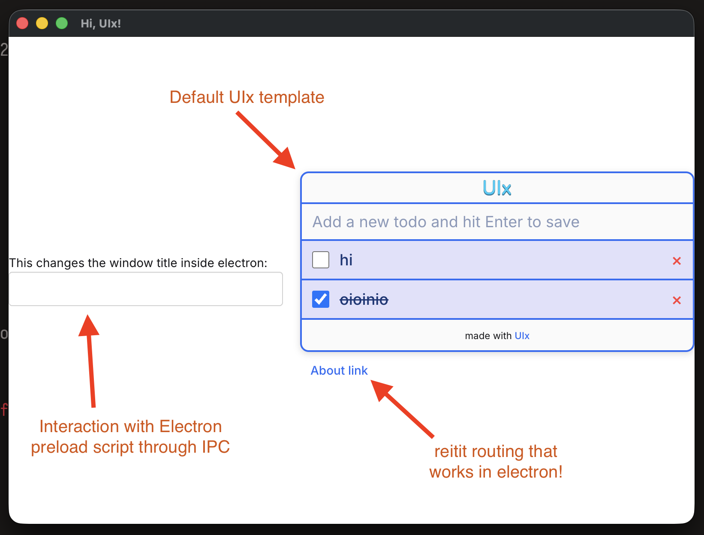

> For a similar starter with Wails, [look here](https://github.com/Sleepful/cljs-uix-wails)

# Uix + Electron starter

Includes simple reitit router example.

It also includes [ Daisy UI ](https://daisyui.com/components/input/) + Tailwind for CSS.

## Reframe + Uix

Initial boiler plate starter from [ https://github.com/pitch-io/uix-starter ](uix-starter) by using:

```
npx create-uix-app@latest my-app --re-frame # adds re-frame setup
```

## However

This repo has been expanded to build for Electron by following 
[ thheller/electron-cljs ]( https://github.com/thheller/electron-cljs )

## Development

### Browser
```shell
npm i # install NPM deps
npm run dev # run dev build in watch mode with CLJS REPL
```

The app source files are found in `./src/app/`. The output of compiling the main app files is found in `./public/build/js/`, this build may be opened in the browser, and it is also the view that will be opened in Electron.

### Electron
```shell
# in another shell:
npm run el # or just `npx electron .`
```

The Electron source files are found in `./src/electron/`. The output of compiling the Electron files is found in `./public/build/electron/`

### How it looks



## Production TODO

```shell
npm run release # build production bundle (from uix boilerplate, has not been verified with electron)
```
